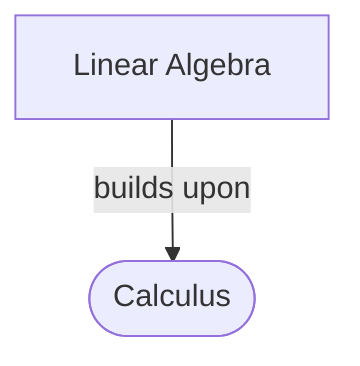

# Calculus
_Method: teacher_

## Concept map

## Resources

## Practice

**1. (mcq)** Find the derivative of f(x) = x^2 + 3x - 4.
   - A. f'(x) = 2x + 3
   - B. f'(x) = 2x - 3
   - C. f'(x) = x^2 + 6x - 8
   - D. f'(x) = 2

**2. (free_text)** Explain the concept of a limit in calculus.
